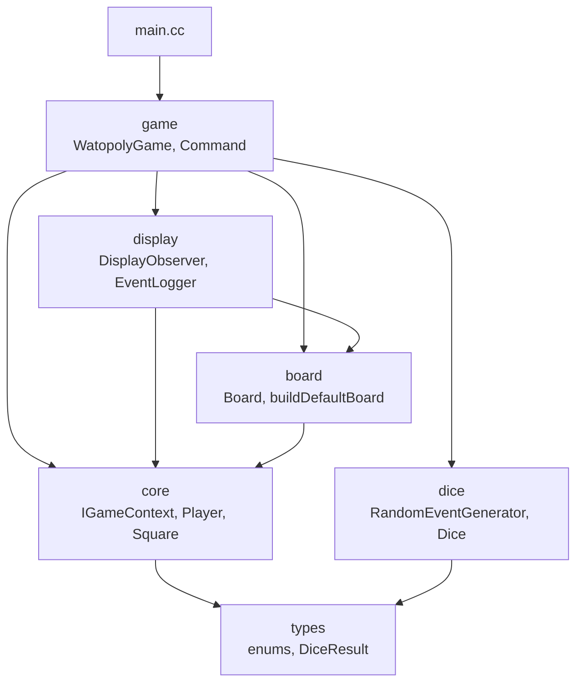
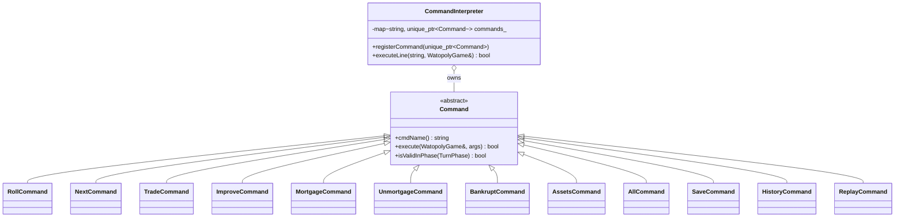
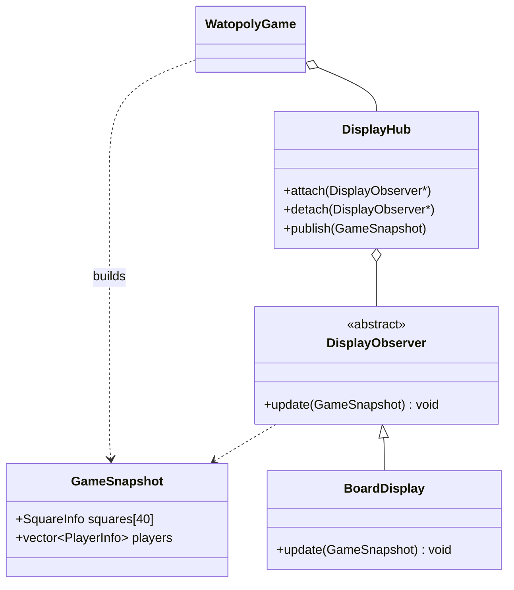
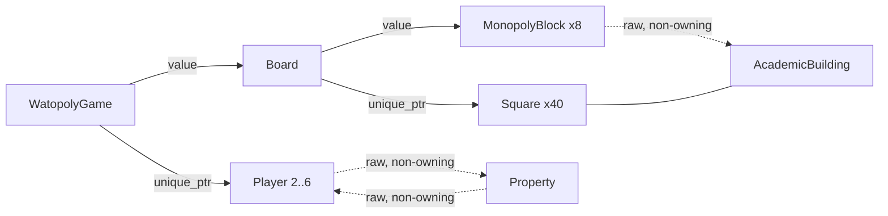

# Watopoly

A text-based Monopoly variant themed around the University of Waterloo campus, written in
C++20 using modules. Built for the CS 246 final project.

*Brian Fu, Cristophe Chen*

Two to six players move around a 40-square campus board, buying academic buildings,
residences and gyms, collecting OSAP, dodging tuition, and occasionally getting stuck in
the DC Tims Line. The last player who is not bankrupt wins.

```
_________________________________________________________________________________________
|Goose  |       |NEEDLES|       |       |       |       |       |       |       |GO TO  |
|Nesting|-------|HALL   |-------|-------|-------|-------|-------|-------|-------|TIMS   |
|       |EV1    |       |EV2    |EV3    |V1     |PHYS   |B1     |CIF    |B2     |       |
|       |       |       |       |       |       |       |       |       |       |       |
|_______|_______|_______|_______|_______|_______|_______|_______|_______|_______|_______|
|       |                                                                       |       |
|-------|                                                                       |-------|
|OPT    |                                                                       |EIT    |
|       |                                                                       |       |
|_______|                                                                       |_______|
|       |                                                                       |       |
|-------|                                                                       |-------|
|BMH    |                                                                       |ESC    |
|       |                                                                       |       |
|_______|                                                                       |_______|
|SLC    |                                                                       |SLC    |
|       |                                                                       |       |
|       |                                                                       |       |
|       |                                                                       |       |
|_______|                                                                       |_______|
|       |            #   #  ###  #####  ###  ####   ###  #    #   #             |       |
|-------|            # # # #   #   #   #   # #   # #   # #     # #              |-------|
|LHI    |            ## ## #####   #   #   # ####  #   # #      #               |C2     |
|       |            #   # #   #   #    ###  #      ###  #####  #               |       |
|_______|                                                                       |_______|
|       |                                                                       |       |
|-------|                                                                       |-------|
|UWP    |                                                                       |REV    |
|       |                                                                       |       |
|_______|                                                                       |_______|
|       |                                                                       |NEEDLES|
|-------|                                                                       |HALL   |
|CPH    |                                                                       |       |
|       |                                                                       |       |
|_______|                                                                       |_______|
|       |                                                                       |       |
|-------|                                                                       |-------|
|DWE    |                                                                       |MC     |
|       |                                                                       |       |
|_______|                                                                       |_______|
|       |                                                                       |COOP   |
|-------|                                                                       |FEE    |
|PAC    |                                                                       |       |
|       |                                                                       |       |
|_______|                                                                       |_______|
|       |                                                                       |       |
|-------|                                                                       |-------|
|RCH    |                                                                       |DC     |
|       |                                                                       |       |
|_______|_______________________________________________________________________|_______|
|DC Tims|       |       |NEEDLES|       |       |TUITION|       |SLC    |       |COLLECT|
|Line   |-------|-------|HALL   |-------|-------|       |-------|       |-------|OSAP   |
|       |HH     |PAS    |       |ECH    |MKV    |       |ML     |       |AL     |       |
|       |       |       |       |       |       |       |       |       |       |GB     |
|_______|_______|_______|_______|_______|_______|_______|_______|_______|_______|_______|
```

Each cell shows the square name, the owner's improvements (`I` markers) and the tokens of
any players standing on it — here `G` and `B` are both on Collect OSAP at the start of a
game.

---

## Table of contents

- [Building and running](#building-and-running)
- [Playing](#playing)
- [Command reference](#command-reference)
- [Project structure](#project-structure)
- [Architecture](#architecture)
- [Design patterns](#design-patterns)
- [Memory management](#memory-management)
- [Board layout](#board-layout)
- [Rules implemented](#rules-implemented)
- [Save file format](#save-file-format)
- [Enhancement: action log and replay](#enhancement-action-log-and-replay)
- [Design documents](#design-documents)

---

## Building and running

Requires **GCC 14** with C++20 modules support (`-fmodules-ts`). The Makefile detects the
host OS and picks the right flags, so the same build works on macOS and on Linux/WSL.

```sh
make            # builds ./watopoly
make clean      # removes objects, the module cache and the binary
./watopoly
```

The first build precompiles the standard library header units into `gcm.cache/`, which
takes noticeably longer than the rest of the build. Subsequent builds reuse the cache.
Because module builds are order-sensitive, the Makefile compiles every module interface
(`src/*.cc`) before its implementation (`src/*-impl.cc`).

### Command-line flags

| Flag | Effect |
| --- | --- |
| `-testing` | Enables `roll <d1> <d2>` so dice can be chosen instead of rolled. |
| `-load <file>` | Resumes a saved game instead of running setup. |
| `-seed <n>` | Seeds the random generator (default `42`, so runs are reproducible). |
| `-enablelog` | Records an action log, and enables `history` and `.replay` output on save. |
| `-enable-replay` | Enables the `replay` command. |

```sh
./watopoly -testing -seed 7
./watopoly -load game.sv
./watopoly -enablelog -enable-replay
```

---

## Playing

Setup asks for a player count (2–6), then a name and a piece for each player. Names must be
unique and `BANK` is reserved; pieces are `G` (Goose), `B` (GRT Bus), `D` (Doughnut),
`P` (Professor), `S` (Student), `$` (Money), `L` (Laptop) and `T` (Pink Tie). Everyone
starts on Collect OSAP with $1500.

A turn runs through three phases. Before rolling, a player can trade, mortgage, improve,
check assets or save. After rolling and resolving the square they landed on, they can do
the same and then `next` to pass play on. If they owe more than they can pay, the turn
enters debt resolution and only cash-raising actions are accepted until the debt is settled
or the player declares bankruptcy.

```
--- Brian's turn ---
> roll 1 2
Brian rolled 1 + 2 = 3
Brian lands on ML (square 3).
ML is unowned. Cost: $60
Would you like to buy it? (yes/no): yes
Brian bought ML for $60.

> assets
Brian (G):
  Cash: $1440
  Roll Up the Rim cups: 0
  Properties:
    ML
  Total worth: $1500

> next
```

Invalid input is re-prompted rather than treated as a refusal — a mistyped answer to a
purchase, tuition or trade prompt asks again instead of silently declining.

---

## Command reference

| Command | Available in | Description |
| --- | --- | --- |
| `roll` / `roll <d1> <d2>` | before rolling | Rolls the dice and moves. The two-argument form needs `-testing`. Three consecutive doubles sends the player to the DC Tims Line. |
| `next` | after rolling | Ends the turn. |
| `trade <name> <give> <receive>` | before/after rolling, in debt | Offers a trade. Each side is either a cash amount or a property name. The other player accepts or rejects. |
| `improve <property> buy\|sell` | before/after rolling; sell only, in debt | Buys or sells an improvement. Requires the whole monopoly block; selling returns half the improvement cost. |
| `mortgage <property>` | before/after rolling, in debt | Mortgages a property for half its purchase cost. |
| `unmortgage <property>` | before/after rolling | Buys the property back for 60% of its purchase cost (70% if it was received mortgaged in a bankruptcy). |
| `bankrupt` | in debt | Declares bankruptcy. Assets pass to the creditor, or are auctioned by the bank. |
| `assets` | any time | Prints the current player's cash, cups, properties and total worth. |
| `all` | any time | Prints the same for every player. |
| `save <filename>` | before/after rolling | Writes the game state (and the action log, if enabled). |
| `history [n]` | any time | Prints the action log, optionally the last `n` entries. Requires `-enablelog`. |
| `replay <file.replay>` | any time | Replays a saved action log. Requires `-enable-replay`. |

Unknown commands and commands used in the wrong phase are reported without ending the turn.

---

## Project structure

```
watopoly/
├── Makefile                 # OS-aware module build
├── README.md
├── src/
│   ├── types.cc             # module types      — enums, DiceResult, piece conversions
│   ├── core.cc              # module core       — IGameContext, Player, Square hierarchy
│   ├── core-impl.cc
│   ├── board.cc             # module board      — Board, buildDefaultBoard
│   ├── board-impl.cc        #                     the 40-square campus layout
│   ├── dice.cc              # module dice       — RandomEventGenerator, Dice
│   ├── dice-impl.cc
│   ├── display.cc           # module display    — observers, GameSnapshot, EventLogger
│   ├── display-impl.cc      #                     the text board renderer
│   ├── game.cc              # module game       — WatopolyGame, Command hierarchy
│   ├── game-impl.cc         #                     turn loop, auctions, trades, save/load
│   └── main.cc              # entry point
├── plan/
│   ├── plan.md / plan.pdf   # DD1 written plan
│   ├── uml.puml / uml.pdf   # DD1 class diagram
│   ├── uml-final.puml       # class diagram as built
│   ├── uml-final.pdf
│   ├── design.pdf           # final design document
│   └── enhancements.md      # candidate enhancements
└── instructions/
    ├── watopoly.pdf/.txt              # assignment specification
    ├── project_guidelines.pdf/.txt    # CS 246 project guidelines
    └── course_notes.txt
```

Each module is split into an interface unit (`x.cc`) and an implementation unit
(`x-impl.cc`), so changing a function body only recompiles one translation unit.

---

## Architecture

Modules depend in one direction only, which keeps the dependency graph acyclic and makes
the build order in the Makefile explicit.



The central problem is that squares need to act on the game — send a player to the Tims
Line, start a purchase prompt, charge a debt — while the game owns the board that owns the
squares. Depending on `WatopolyGame` directly would make that a cycle. Instead, `core`
declares a narrow interface, `IGameContext`, that squares call back through; `WatopolyGame`
lives in `game` and implements it. `core` never learns that `WatopolyGame` exists.

```plantuml
interface IGameContext {
  +void sendPlayerToTims(Player &player)
  +void promptPurchase(Player &player, Property &property)
  +void handleDebt(Player &debtor, int amount, Player *creditor)
  +void handleTuition(Player &player)
  +DiceResult rollForGym()
  +void awardCup(Player &player)
  +void resolveLanding(Player &player, int squareIndex)
  +void logEvent(const std::string &msg)
  +SLCEvent generateSLCEvent()
  +int generateNeedlesHallDelta()
  +bool checkRollUpTheRim()
  +TurnPhase getCurrentPhase() const
  +Player &currentPlayer()
  +std::vector<Player *> getActivePlayers()
  +Player *findPlayer(const std::string &name)
}

WatopolyGame ..|> IGameContext
Square ..> IGameContext
```

*(excerpt from [`plan/uml-final.puml`](plan/uml-final.puml); the full diagram is rendered in
[`plan/uml-final.pdf`](plan/uml-final.pdf))*

The same interface is why randomness lives in `dice` but is reachable from `core`: an SLC
square asks `game.generateSLCEvent()` rather than importing the generator itself.

---

## Design patterns

### Template Method — landing on a property

`Property::landOn` is written once and handles every ownable square: unowned means prompt
for a purchase, owned by someone else means charge a fee, mortgaged means nothing happens.
The one part that varies, the fee, is the abstract hook.

```plantuml
abstract class Square {
  +const std::string &name() const
  +int index() const
  +{abstract} void landOn(Player &player, IGameContext &game)
  +virtual bool isProperty() const
  +virtual bool isAcademic() const
}

abstract class Property {
  +void landOn(Player &player, IGameContext &game)
  +{abstract} int calculateFee(Player &visitor, IGameContext &game)
  +void mortgage()
  +void unmortgage()
}

Square <|-- Property
Property <|-- AcademicBuilding
Property <|-- Residence
Property <|-- Gym
Square <|-- CollectOSAP
Square <|-- DCTimsLine
Square <|-- GoToTims
Square <|-- GooseNesting
Square <|-- TuitionSquare
Square <|-- CoopFee
Square <|-- SLCSquare
Square <|-- NeedlesHallSquare
```

Each subclass supplies only its own rule: an academic building indexes a tuition table by
improvement count, a residence scales with how many residences the owner holds, and a gym
multiplies the roll that brought the visitor there.

### Command — the interpreter

Every player action is a `Command` object registered in a map by name. Adding a command
means writing one class and registering it; the interpreter itself never changes. Each
command declares the turn phases it is legal in, so phase checking is data on the command
rather than a growing conditional in the turn loop.



### Observer — the display

The board renderer is an observer, but it is never handed the live game. `WatopolyGame`
builds a `GameSnapshot` — plain structs holding names, owners, improvement counts and
player positions — and publishes that through the `DisplayHub`. The renderer therefore
cannot mutate game state, and a second view (a scoreboard, a different board style) can be
attached without touching the game at all.



### Turn state as data

Per-turn state lives in a `TurnContext` struct rather than in loose members, so saving,
restoring and inspecting a turn is a single assignment. That is what lets a mortgage
transfer fee be collected from a player who is not the active one: the game swaps in a
temporary context, resolves the payment, and restores the original.

```cpp
struct TurnContext {
    int currentPlayerIndex = 0;
    TurnPhase phase = TurnPhase::PreRoll;
    int consecutiveDoubles = 0;
    DiceResult lastRoll;
    Player *debtCreditor = nullptr;
    int debtAmount = 0;
};
```

---

## Memory management

There are no `new` or `delete` statements outside of `std::make_unique`, and no leaks:

- `Board` owns the 40 squares as `std::vector<std::unique_ptr<Square>>` and the 8 monopoly
  blocks by value.
- `WatopolyGame` owns the players as `std::vector<std::unique_ptr<Player>>`, so the raw
  `Player *` back-pointers held by `Property::owner_` stay valid as the vector grows.
- `MonopolyBlock` holds non-owning `AcademicBuilding *` pointers back into squares the
  board already owns, so nothing is owned twice.
- `CommandInterpreter` owns its commands as `std::unique_ptr<Command>` values in a map.
- Trades are built and resolved on the stack inside `TradeCommand::execute` and never
  outlive the command.



Solid arrows are ownership; dashed arrows are observation.

---

## Board layout

| # | Square | # | Square | # | Square | # | Square |
| --- | --- | --- | --- | --- | --- | --- | --- |
| 0 | Collect OSAP | 10 | DC Tims Line | 20 | Goose Nesting | 30 | Go To Tims |
| 1 | AL | 11 | RCH | 21 | EV1 | 31 | EIT |
| 2 | SLC | 12 | PAC *(gym)* | 22 | Needles Hall | 32 | ESC |
| 3 | ML | 13 | DWE | 23 | EV2 | 33 | SLC |
| 4 | Tuition | 14 | CPH | 24 | EV3 | 34 | C2 |
| 5 | MKV *(res)* | 15 | UWP *(res)* | 25 | V1 *(res)* | 35 | REV *(res)* |
| 6 | ECH | 16 | LHI | 26 | PHYS | 36 | Needles Hall |
| 7 | Needles Hall | 17 | SLC | 27 | B1 | 37 | MC |
| 8 | PAS | 18 | BMH | 28 | CIF *(gym)* | 38 | Coop Fee |
| 9 | HH | 19 | OPT | 29 | B2 | 39 | DC |

The 24 academic buildings are grouped into eight monopoly blocks: Arts1, Arts2, Eng,
Health, Env, Sci1, Sci2 and Math.

---

## Rules implemented

**Movement.** Two dice; doubles roll again, and a third consecutive double sends the player
straight to the DC Tims Line. Passing Collect OSAP pays $200; landing exactly on it pays
$200 once, not twice.

**Academic buildings.** Owning a full monopoly block allows up to five improvements (four
bathrooms, then a cafeteria). Tuition comes from a per-building table indexed by
improvement count, and doubles when the block is owned outright but unimproved. Selling an
improvement returns half its cost.

**Residences and gyms.** Residence fees are $25 / $50 / $100 / $200 for one through four
residences owned. Gym fees are four times the visitor's roll, or ten times if the owner
holds both gyms — using the roll that landed the player there, not a fresh one.

**Tuition.** The player chooses $300 or 10% of total worth, which is printed before the
choice is made.

**DC Tims Line.** A player may roll for doubles, pay $50, or spend a Roll Up the Rim cup.
On the third turn they must leave: a failed roll falls through to a forced pay-or-cup
choice.

**SLC and Needles Hall.** Random events drawn with the probabilities given in the
specification.

| SLC | Probability | | Needles Hall | Probability |
| --- | --- | --- | --- | --- |
| Back 3 | 3/24 | | −$200 | 1/18 |
| Back 2 | 4/24 | | −$100 | 2/18 |
| Back 1 | 4/24 | | −$50 | 3/18 |
| Forward 1 | 3/24 | | +$25 | 6/18 |
| Forward 2 | 4/24 | | +$50 | 3/18 |
| Forward 3 | 4/24 | | +$100 | 2/18 |
| Go to Tims | 1/24 | | +$200 | 1/18 |
| Advance to OSAP | 1/24 | | | |

A Needles Hall visit first has a 1% chance of awarding a Roll Up the Rim cup, capped at
four cups in play at once.

**Trades.** Cash or property on either side. Properties with improvements — anywhere in
their block — cannot be traded, and a mortgaged property changing hands owes the bank 10%
of its value immediately. Both fees are checked before any part of the trade is applied, so
a trade never leaves a player holding something they cannot pay for.

**Mortgages.** Mortgaging pays out half the purchase cost and stops rent being collected on
the property. Buying it back costs 60% of the purchase cost — the principal plus 10%
interest — or 70% if it arrived mortgaged through a bankruptcy transfer.

**Debt and bankruptcy.** A player who cannot pay enters debt resolution and may trade,
mortgage, or sell improvements to raise cash. Declaring bankruptcy transfers everything to
the creditor, or, if the debt was to the bank, auctions the properties off to the remaining
players. The auction records every bid and recomputes the leader when someone withdraws.

---

## Save file format

`save <filename>` writes the format from the specification: the player count, one line per
player starting with the current player, then one line per property in board order.

```
2
Brian G 0 1440 3
Toph B 1 1500 10 1 2
AL BANK 0
ML Brian 0
ECH Toph -1
...
```

A player line is `name token cups cash position`; a player on square 10 adds `1 <turns>` if
they are in the line and `0` if they are only visiting. A property line is
`name owner improvements`, where the owner is `BANK` when unowned and the improvement
count is `-1` when the property is mortgaged. `-load <file>` validates all of this and
refuses malformed saves rather than starting a corrupt game.

---

## Enhancement: action log and replay

With `-enablelog`, the game records every meaningful event — rolls, purchases, rent, OSAP,
coop fees, Needles Hall swings, SLC movement, Tims Line entries and exits, bankruptcies:

```
> history 5
Brian collected $200 from OSAP
Brian paid $45 rent to Toph
Toph gained $25 from Needles Hall
Toph sent to Tims by SLC
Brian paid $150 coop fee
```

Saving also writes a `<filename>.replay` file alongside the save. With `-enable-replay`,
`replay <file>.replay` plays that log back, which makes a finished game reviewable without
re-running it.

---

## Design documents

| Document | Contents |
| --- | --- |
| [`plan/plan.md`](plan/plan.md) | DD1 plan: responsibilities, patterns, division of work, answers to the specification's design questions. |
| [`plan/uml.pdf`](plan/uml.pdf) | DD1 class diagram. |
| [`plan/uml-final.pdf`](plan/uml-final.pdf) | Class diagram as actually built. |
| [`plan/design.pdf`](plan/design.pdf) | Final design document. |
| [`plan/enhancements.md`](plan/enhancements.md) | Enhancement proposals considered for the final submission. |
| [`instructions/`](instructions/) | Assignment specification and course project guidelines. |
